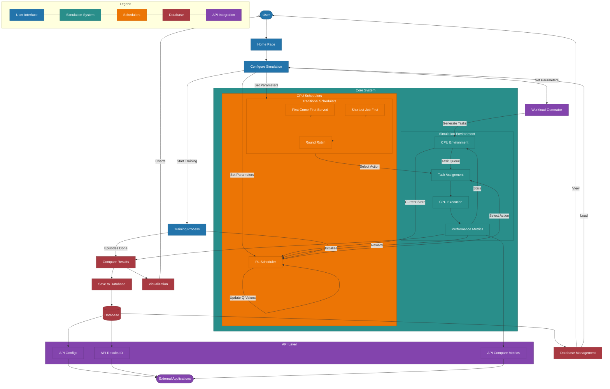

# RL-based CPU Scheduler

## Overview

This project implements a Reinforcement Learning-based CPU scheduler designed for high-performance computing environments, with a particular focus on high-frequency trading (HFT) and real-time systems. The scheduler uses Deep Q-Learning to optimize task assignment across multiple CPU cores, minimizing latency and maximizing throughput.

## Key Features

- **Reinforcement Learning Scheduler**: Uses DQN to learn optimal CPU scheduling policies
- **Traditional Scheduler Comparison**: Benchmarks against FCFS, SJF, and Round Robin
- **Workload Generator**: Creates synthetic workloads that mimic real-world scenarios
- **Web Interface**: Interactive configuration, visualization, and results comparison
- **Database Integration**: Save, load, and manage simulation configurations and results
- **RESTful API**: Access configurations and results programmatically

## System Architecture

The system consists of several key components:

```
┌─────────────────┐     ┌─────────────────┐     ┌─────────────────┐
│  Web Interface  │     │   Reinforcement  │     │   CPU          │
│  - Config Forms │────▶│   Learning      │────▶│   Environment   │
│  - Visualization│◀────│   Scheduler     │◀────│   Simulator     │
└─────────────────┘     └─────────────────┘     └─────────────────┘
         │                                              │
         │                                              │
         │                                              │
         ▼                                              ▼
┌─────────────────┐                           ┌─────────────────┐
│   Database      │                           │   Workload      │
│   Management    │◀─────────────────────────▶│   Generator     │
└─────────────────┘                           └─────────────────┘
```

## Business Applications

This RL-based CPU scheduler has applications across multiple industries:

### Financial Technology
- **High-Frequency Trading Systems**: Reduce latency for time-sensitive trade executions
- **Market Data Processing**: Optimize real-time market data analysis
- **Risk Management Systems**: Ensure critical risk calculations complete with minimal latency

### Cloud Computing
- **Multi-tenant Environments**: Balance resource allocation across users
- **Function-as-a-Service (FaaS)**: Minimize cold-start latency
- **Edge Computing**: Optimize task distribution across edge nodes

### Telecommunications
- **5G Infrastructure**: Improve compute resource allocation in virtualized networks
- **Packet Processing**: Enhance throughput and reduce jitter
- **Network Function Virtualization**: Optimize virtual network function performance

### Industrial Automation
- **Real-time Control Systems**: Ensure predictable response times
- **Manufacturing Execution Systems**: Optimize computation tasks in production environments
- **IoT Gateways**: Efficiently process data from multiple IoT devices

## Technology Stack

- **Backend**: Python, Flask, SQLAlchemy
- **Frontend**: HTML, CSS (Bootstrap), JavaScript
- **Machine Learning**: TensorFlow, NumPy, Pandas
- **Visualization**: Matplotlib, Chart.js
- **Database**: SQLite
- **API**: RESTful JSON endpoints

## Installation

1. Clone the repository:
   ```bash
   git clone https://github.com/shar2710/cpu_ml.git
   cd f
   ```

2. Install dependencies:
   ```bash
   pip install -r requirements.txt
   ```

3. Run the application:
   ```bash
   python main.py
   ```

4. Access the web interface at http://localhost:5000 and https://rl-scheduler.onrender.com


### Web Interface

1. **Configure Simulation**: Set parameters for the CPU environment and RL model
2. **Train RL Model**: Set number of episodes and start training
3. **Compare Results**: View comparison between RL and traditional schedulers
4. **Save Results**: Store configurations and results in the database
5. **Load Configurations**: Reload saved configurations for further testing


## Performance Metrics

The system evaluates scheduler performance using several key metrics:

- **Average Latency**: Average time from task arrival to completion
- **Throughput**: Number of tasks completed per unit time
- **CPU Utilization**: Percentage of time CPUs are busy processing tasks
- **Reward**: Weighted combination of latency reduction and throughput improvement


